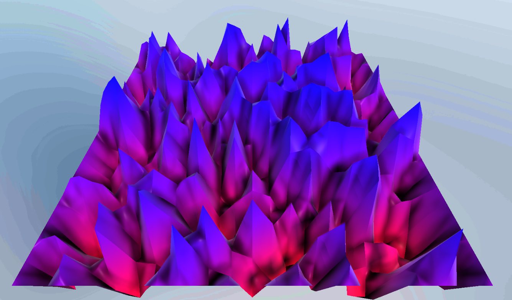
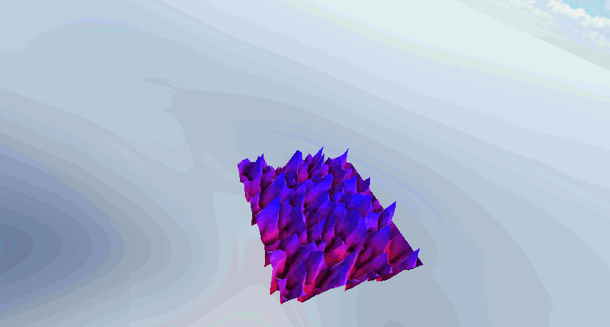
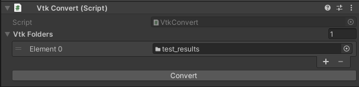

# vtkUnity

vtkUnity is a project which aims to deliver universal compatibility between vtk files and the Unity3D game engine.   
The project comprises of series of open source C# scripts which currently implement support for non-XML vtk files. The scripts are written with hackability and portability in mind. The main motivation for this project was to allow for the dynamic render of dynamic datasets on VR headsets which run android (Oculus Quest). This resulted in a library which is fully portable and can support all mobile, desktop and web platforms.

# Functionality
vtkUnity allows people to upload standard vtk files into the unity editor and render them as gameObjects.
## 💼 Portability
vtkUnity is a fully portable project and supports all devices covered by the unity engine using the same scripts. This is achieved in two ways.

Firstly, all scripts are written entirely in C#; hence they act as a managed unity plugin which is fully portable on all supported unity platforms.

Secondly, all vtk files are converted to unity text assets before they are parsed. This allows us to load them through the **Resources** folder which again guarantees functionality on all supported platforms.

These aspects make this project great for VR implementations, where the target device may be running android such as the Oculus Quest and indeed that was the main motivation behind this project.
## 🍭 Vertex Coloring
The project supports custom materials, both regular and Universal render pipeline, with vertex coloring which is used to display various vector and scalar fields directly on the object's geometry, as shown below:

Gradients are handled by unity's native gradient controller so there is great flexibility in how the color scheme can be arranged.

## 🧃 Geometry wrapping
The project also supports vector wrapping for 3D objects and scalar wrapping for 2D objects. This can be used as a visual aid to show things such as an object's displacements.

## 🏃‍♀️ Animation
vtkUnity also offers animation support to display dynamic datasets. It offers granular setting to change frame rate and the displayed vector/scalar field dynamically in-game, which allows users to create custom control panels for players.

## 🛠️ In Editor tools
vtKUnity provides the user with editor tools to convert vtk files into unity text assets. This was done to ensure portability and smooth execution on various platforms, namely Android and iOS devices.

## 🐦 Compactness and efficiency
One of the main goals of this project was to make a compact and efficient library. To maintain compactness the library uses 7 scripts which handle conversion, file loading, geometry modifications, rendering and animations. To render objects, the vertex information is stored in unity's native vector3 format. This reduces overhead when animating as the new vertex data is directly assigned to the object's MeshFilter.

# How to use
## To use the library you need to copy all the scripts from the scripts folder to your own project and that is it. 😊

# How to setup the project
1. Drag the VtkConvert and VtkFileHandler to an empty gameObject in the scene. 
2. Place all your vtk datasets into separate folders somewhere in the assets of your project
3. Make sure you have a Resources folder (empty or not).
4. Drag the dataset folders into the Vtk Folders field of VtkConvert
5. Click on the "Convert" button
    This will generate folders named vtk_# in the Resources folder. For each vtk folder there will be one config file with a matching name.
6. Drag the config files on to the VtkObj field of the VtkFileHandler.
7. Assign a proper shader in the color shader field.

Once you hit play the file handler will load all the files into memory and render them. Each new file has properties which you can edit in game. If the object turns out to be a neon purple color that means that your shader does not support vertex colors. In the project there are two shaders available (one for URP and one for standard) which you can use.

# Contributing
If you want to contribute any features, feel free to make a pull request. Also have a look at future development to see what things I am trying to add currently. Any help is greatly appreciated.

In your PR please write a medium sized description of what your changes do. Also try to stay away from platform specific implementations as stated before portability is one of the pillars of this project. Currently I am the sole developer of this project so don't be afraid to drop me a line and ask about things.

# Future development
There are a few points on which future development is based. They are:  

1. Providing more tools to user. My hope is that the average user wil not need any coding to set up a scene.
2. Adding xml vtk file support.
3. Creating a additional render pipeline for high-order elements
4. Adding all of vtk's render cell types.

